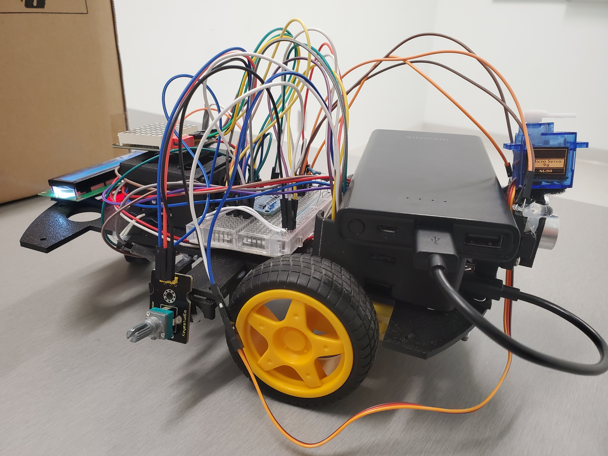
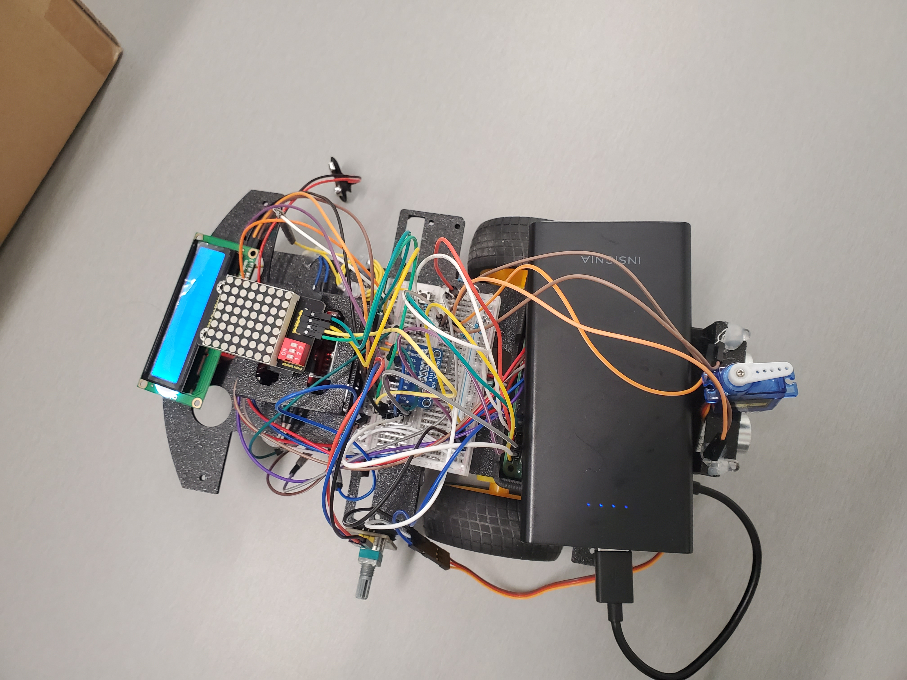
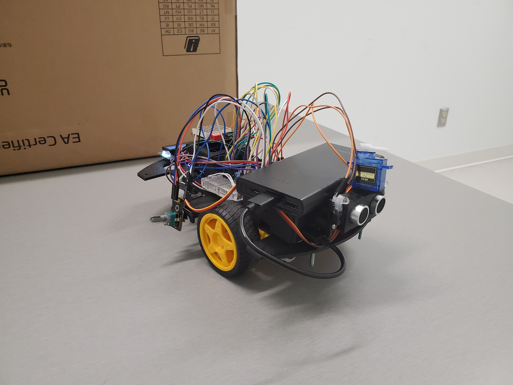
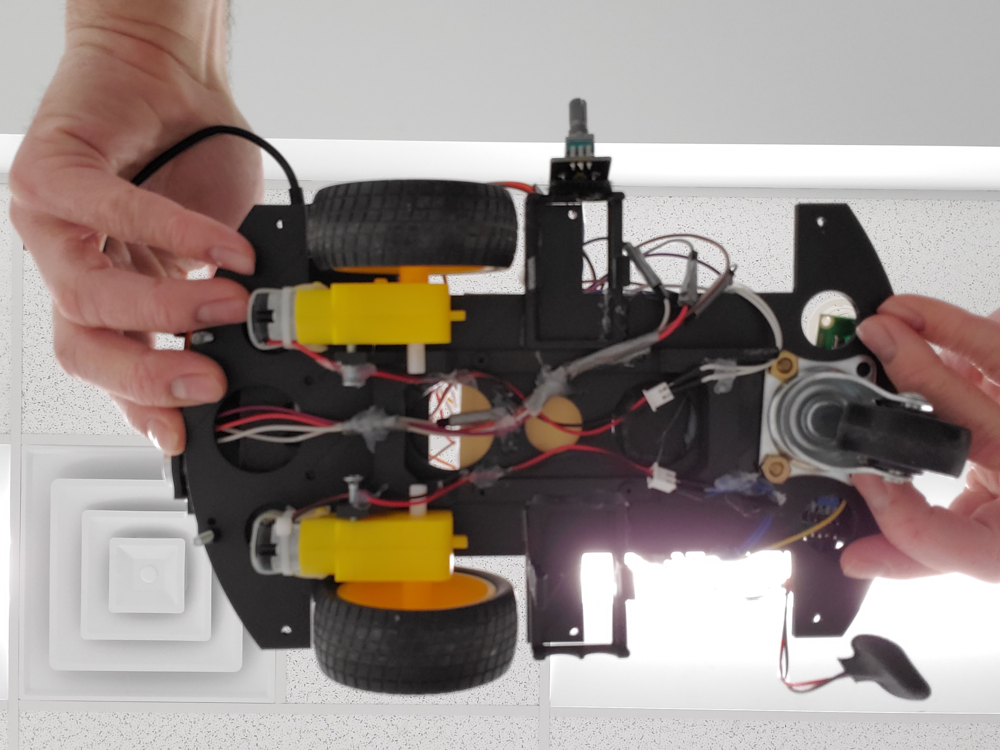
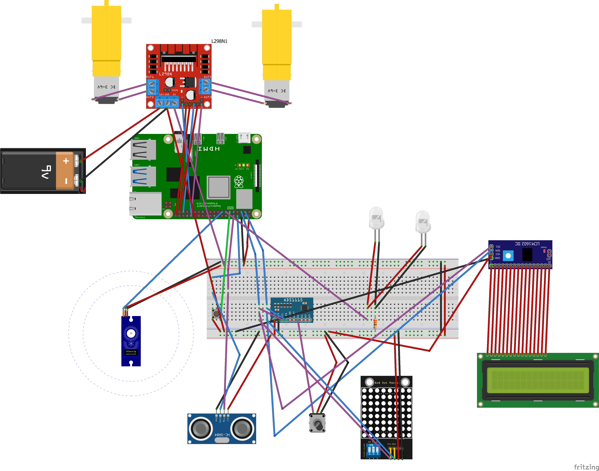

# RC Car raspberry project

## Categories

- Introduction
- Connections
- Librairies
- Ps3 controller
- Controls
- Questions & Suggestions
## introduction:
This project was made by Ghostz01 and Guerre450 for a school project.
From now onwards i'll refer to "we"/"us" to describe our personal experience.

### Thoughts
This project took multiple tries. Mostly, due to the physical aspect of the project being new to us. If we had the chance to rebuild it, we would do things differently to avoid some of the issue we've encountered.

However, considering this was a pretty crazy project that far surpassed the requirements of the course. i'd say we did a pretty good job.

### Physical Issues
We won't be going over the process of the physical build. Since, we'd have to build a new one to do so. However, we can tell some of the issues we've had so others can avoid them:

- One of the wheels kept spinning off the motor after a while. This is due to the wheels not being completely straight. We would avoid this issue next time by securing the wheels more tightly.

- We ran in a weight problem early on. If you look at one of the pictures, you'll see the pi is in the front. We used to have it in the back instead, but this caused the turning to be less accurate.

## Connections

This sketch doesn't represent the actual connection on our board since it's much smaller. However, it should still work. 

If the wheels don't turn in the right direction, invert the motor's pins which are connected to the driver board.

## Librairies
 - Adafruit-Blinka                          8.50.0
 - adafruit-circuitpython-ads1x15           2.4.1
 - adafruit-circuitpython-busdevice         5.2.10
 - adafruit-circuitpython-connectionmanager 3.1.2
- adafruit-circuitpython-ht16k33           4.6.10
- adafruit-circuitpython-requests          4.1.8
- adafruit-circuitpython-typing            1.11.2
- pigpio                                   1.78
- pygame                                   2.1.2
- RPi.GPIO                                 0.7.1
- rpi-lcd                                  0.0.3 (https://github.com/bogdal/rpi-lcd)
- six                                      1.16.0 (downloading sixpair for ps3 controller)

If your rapsberry doesn't already have these libraires. Looking the libraries up should give you the command to download them.

## 3D frame
- [Raspberry Pi](https://makerworld.com/en/models/579053#profileId-499808)
- [L298N](https://www.thingiverse.com/thing:2345015/files)
- [Car Frame](https://www.thingiverse.com/thing:2151514)
- [Ultrasonic Mount](https://www.printables.com/model/158419-ping-sensor-servo-mount-for-4-pin-ultra-sonic-sens)
- [Battery Holder](https://makerworld.com/en/models/27485?from=search#profileId-268558)

## PS3 Controller
to connect the controller to the Pi you have to use bluetoothctl and maybe sixpair(try to connect using bluetoothctl only first).

you can follow this guide:
https://low-orbit.net/how-to-connect-ps3-or-ps4-controller-to-raspberry-pi

if the pin doesn't work try this solution:
https://askubuntu.com/questions/1497783/why-does-official-ps3-bluetooth-controller-no-longer-work-and-pin-code-suddenly

## Controls
Here are the basic controls for the project:

- Turning: use the left joystick. the left joytick's x axis is used to decide the turnrate. the current turn rate is reflected on the Servo in front of the car.

- Gas : Pressing R2 allows to control the speed, the force applied to the bumper reflects the speed of the car. Therefore, no force means no speed.

- forward : Pressing X will make the car go forward(Gas needs to be held to advance).

- reverse : Pressing CERCLE will make the car go in reverse (Gas needs to be held to advance).

- lights : Pressing SQUARE will turn on/off the lights in front of the car.

- detection distance : Adjusting the Potentiometer will adjust the detection distance as reflected on the lcd screen.
- end program : Pressing TRIANGLE or the button on the car will end the program.

## Questions & Suggestions
As you probably guessed, this was a student project.
If you have any suggestions, you can create an issue with the suggestion/feature/bug tag.
If you have any questions, you can create an issue with question tag.
I will try to answer any questions, to the best of my capabilities.